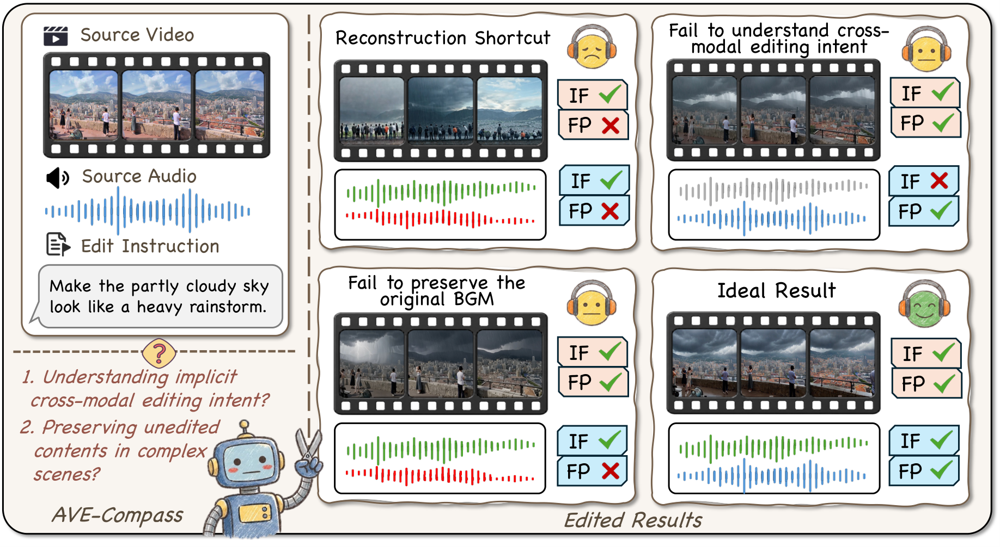
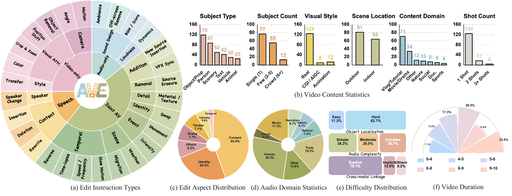
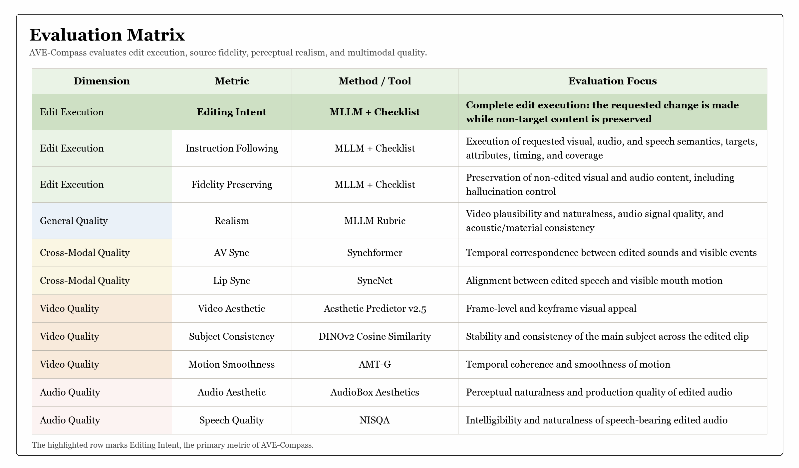

<h1 align="center">AVE-Compass</h1>

---

<p align="center"><i>Can audio-visual editing models correctly follow cross-modal instructions?</i></p>

<p align="center">
  
</p>

<details>
  <summary><b>Dataset Statistics</b></summary>
  <p align="center">
    
  </p>
</details>

<p align="center">
  <a href="#citation"></a>
  <a href="https://huggingface.co/datasets/NJU-LINK/AVE-Compass"></a>
  <a href="https://github.com/NJU-LINK/AVE-Compass"></a>
</p>

**Work overview.** AVE-Compass is a diagnostic benchmark for free-form audio-video editing, built from 145 curated source videos, 196 audio-visually coupled instructions, and 2,688 fine-grained checklist items. Its evaluation separates Instruction Following, Fidelity Preserving, Realism, and Editing Intent, combining MLLM-as-Judge evaluation with automated cross-modal, video, and audio metrics to expose incomplete edits, non-target drift, perceptual artifacts, and audio-visual misalignment.

**Repository overview.** This repository provides the AVE-Compass evaluation pipeline, configuration files, input templates, metric implementations, and AVE-Agent. The evaluator processes source videos, edit instructions, checklists, and model-generated edited videos with MLLM and objective metrics, while the [AVE-Compass dataset](https://huggingface.co/datasets/NJU-LINK/AVE-Compass) provides the benchmark samples. AVE-Agent provides a planning and self-reflection baseline for complex editing instructions.

<p align="center">
  <a href="#evaluation-code">Evaluation Code</a> &middot;
  <a href="#key-findings">Key Findings</a> &middot;
  <a href="#ave-agent">AVE-Agent</a>
</p>

---

## What We Evaluate

AVE-Compass contains 145 curated source videos, 196 human-verified editing instructions, 2,688 checklist items, and 28 editing operation types across joint, speech, video-only, and audio-only editing.

The benchmark reports four complementary dimensions:

| Dimension | Description |
| --- | --- |
| **Instruction Following** | Whether the requested edit is correctly executed |
| **Fidelity Preserving** | Whether non-target visual and audio content remains faithful to the source |
| **Editing Intent** | Whether the output both follows the instruction and preserves non-target content |
| **Realism** | Whether the edited audio-video result is natural and coherent |

The evaluation package also reports automated cross-modal, video, and audio metrics, together with source-preservation diagnostics for single-modality edits.

<p align="center">
  
</p>

## Leaderboard

Models are ranked by **Overall Editing Intent**, the primary metric of AVE-Compass. Scores are reported on a 0-100 scale, and higher is better.

| Rank | Model | Overall | Video | Audio |
| ---: | --- | ---: | ---: | ---: |
| 1 | **AVE-Agent (Wan)** | **59.8** | **66.7** | **50.2** |
| 2 | Wan2.7 | 42.4 | 60.1 | 24.8 |
| 3 | HappyHorse | 41.3 | 56.7 | 18.8 |
| 4 | Gemini-Omni* | 38.0 | 56.1 | 10.0 |
| 5 | Seedance | 26.6 | 36.1 | 13.5 |
| 6 | LTX2 | 15.2 | 10.7 | 26.4 |

*Gemini-Omni misses 16 speech edits due to content moderation.

## Evaluation Code

### 1. Configure Environment

Install the dependencies and model weights required by the selected metrics, and make sure `ffmpeg` and `ffprobe` are available on `PATH`. MLLM evaluation uses the official Gemini API:

```bash
export GEMINI_API_KEY=your_key
export DEFAULT_MODEL=your_model
```

```yaml
modules: {objective: true, llm: true}
llm: {checklist: true, realism: true}
```

### 2. Prepare Inputs

Download the released source videos, instructions, and checklists into the three default directories:

```bash
hf download NJU-LINK/AVE-Compass --type dataset \
  --include "videos/*" \
  --include "edit_instructions/*" \
  --include "checklists/*" \
  --local-dir input
```

Place the videos produced by the model under evaluation in `edited_videos/`:

```text
input/
|- videos/                         # downloaded
|- edit_instructions/              # downloaded
|- checklists/                     # downloaded
`- edited_videos/<sample_id>.mp4   # provided by the user
```

### 3. Run

```text
bash run_eval.sh [input_root] [model_name] [output_path] [config_path] [device]
```

For example:

```bash
bash run_eval.sh \
  input \
  my_model \
  output \
  configs/path.yml \
  cuda
```

The five positional parameters default to `input`, `model`, `output`, `configs/path.yml`, and `cuda`, respectively. Use `cpu` as the last parameter for CPU-compatible metrics.

### 4. Outputs

```text
output/
|- <model_name>_eval_<timestamp>_eval_results.json
|- <model_name>_eval_<timestamp>_eval_results.csv
`- <model_name>/
   `- <sample_id>/
      |- eval_result.json
      |- objective/
      `- llm/
```

The CSV contains one row per evaluated instruction; the JSON additionally retains per-question judgments, metric details, warnings, and aggregate summaries.

## Key Findings

- Current editors often struggle to satisfy instruction execution and non-target preservation at the same time.
- A model that leaves the input unchanged can receive deceptively strong preservation scores, so edit response must be reported separately.
- Audio-side execution and temporal audio-visual alignment remain common failure modes.
- AVE-Agent improves Editing Intent and Instruction Following, with particularly strong gains in audio-side execution and audio-visual synchronization.

## AVE-Agent

This repository also includes **AVE-Agent**, a modular audio-video editing agent that plans dependent subtasks, dispatches modality-specific tools, and refines failed edits through evaluator feedback. See the [`agent/` directory](agent/) for setup, architecture, and usage.

## Repository Layout

```text
./
|- README.md
|- input/
|  |- videos/
|  |- edit_instructions/
|  |- checklists/
|  `- edited_videos/
|- run_eval.sh
|- configs/
|- metrics/
|- modules/
|- models/
|- tests/
|- agent/
`- docs/assets/
```

## Reproducibility Notes

- Input samples are paired by their shared `<sample_id>`, while the source video is resolved from the instruction JSON.
- Missing or disabled objective metrics remain unset and are not converted into fabricated zero scores.
- MLLM evaluation uses the official Gemini API.

Run the evaluation checks with:

```bash
python -m pytest tests
```

The tests cover input pairing, metric routing, missing-value handling, checklist aggregation, and Realism score normalization.

## Citation

```bibtex
@article{wen2026avecompass,
  title  = {AVE-Compass: Towards Holistic Evaluation for Audio-Video Editing Abilities},
  author = {Wen, Yuqing and Huang, Yukai and Xie, Qianqian and Wu, Jiangtao and Lin, Yibin and Gu, Yikai and Chen, Jialu and Zhang, Yuanxing and Liu, Jiaheng},
  year   = {2026}
}
```
