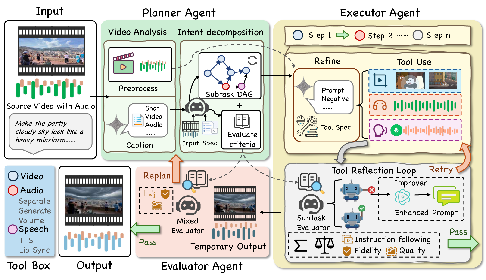

# AVE Agent



AVE-Agent turns a free-form instruction into dependency-aware subtasks, executes them with self-check retries, and evaluates the assembled clip before applying targeted remixing, regeneration, or feedback-guided full replanning.

## Install

```bash
python3 -m venv .venv
source .venv/bin/activate
pip install -r requirements.txt
```

`ffmpeg` and `ffprobe` must be available on `PATH`.

```bash
# macOS
brew install ffmpeg

# Ubuntu/Debian
sudo apt install ffmpeg
```

Copy the environment template and fill in the keys you use:

```bash
cp .env.example .env
```

Required for the default cloud setup:

```text
GEMINI_API_KEY=
FAL_KEY=
```

## Run

```bash
python run.py \
  --video path/to/input.mp4 \
  --instruction "Turn the sky overcast and add rain" \
  --output final.mp4
```

Useful flags:

```bash
# Write intermediates under a custom workspace
python run.py -v input.mp4 -i "Make it cyberpunk" --workspace workspace

# Plan only, without calling editing tools
python run.py -v input.mp4 -i "Add rain sounds" --plan-only

# Reuse an existing session and rerun only the audio stage
python run.py --reuse-session SESSION_ID -i "Lower the background music"
```

## Video Backend

The default video editor is fal.ai Wan 2.7 and uses `FAL_KEY`.

```bash
python run.py -v input.mp4 -i "Make it cinematic" --video-backend wan
```

Wan is the default. Seedance is also available as a reference-to-video
generation backend. You can set the default in `.env`:

```text
VIDEO_BACKEND=wan
```

Available video backends:

```bash
python run.py -v input.mp4 -i "Make it cinematic" \
  --video-backend wan

python run.py -v input.mp4 -i "Make it cinematic" \
  --video-backend seedance
```

`seedance` uses reference-to-video regeneration rather than a true V2V edit.
