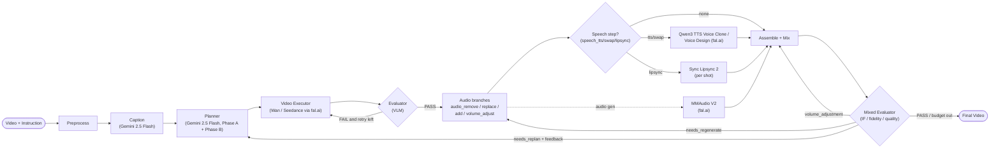

# AVE Agent - Architecture



## Stages

### 1. Preprocess
- Extract metadata with ffprobe: resolution, frame rate, duration, codec.
- Split audio (`audio.aac`) from the video-only stream.
- Tone-map HDR to SDR with zscale + hable and normalize SAR to 1:1.
- Resize width into the [720, 2160] range.
- Extract 1-3 keyframes for downstream modules.

### 2. Caption
- Send the full video to Gemini 2.5 Flash through Google's official Gemini API.
- Produce visual description, audio description, and shot-list JSON.
- Provide scene context to the Planner.

### 3. Planner
- Phase A converts instruction + keyframes + caption + metadata into natural
  language steps with `action`, `intent`, `shot_index`, `depends_on`, and audio
  inventory fields.
- Phase B converts each step into tool prompts in parallel.
- Video actions: `style_transfer`, `scene_edit`, `add_object`,
  `remove_object`, `replace_object`, `recolor`, `repainting`,
  `depth_modify`, `motion_edit`.
- Audio actions: `audio_add_sfx`, `audio_add_ambient`, `audio_replace_sfx`,
  `audio_replace_bgm`, `audio_remove`, `audio_volume_adjust`.
- Speech actions: `speech_tts`, `speech_swap`, `speech_lipsync`.
- Compatible video intents for the same shot are merged by default to reduce
  expensive V2V calls.

### 4. Video Executor + Evaluator
- `ToolRegistry` selects tools by priority. Wan 2.7 via fal.ai is the default
  video backend; Seedance is available for reference-to-video regeneration.
- Tools upload the video, submit the job, poll, and download the result.
- The Evaluator compares before/after keyframes against `eval_criteria`.
- Passing thresholds are `quality >= 0.6` and `consistency >= 0.7`.
- Failed attempts retry within a small budget; exhausted retries keep the best
  available result and continue.

### 5. Audio Branches
- `_run_step_audio` dispatches to remove, replace, add, or volume branches.
- fal.ai SAM Audio is the default separation backend. Local AudioSep is a
  fallback.
- MMAudio V2 generates new audio from video + text prompt.
- Each branch ends with `_post_branch_eval`.
- SAM and MMAudio have internal retry loops and keep the best scored output.

### 6. Speech Branches
- `speech_tts`: keep the speaker stem with SAM Audio, clone it with Qwen3 TTS,
  then mix it back with the residual track.
- `speech_swap`: similar flow, but uses Qwen3 TTS Voice Design without a
  reference voice.
- `speech_lipsync`: slices shots and calls Sync Lipsync 2 to align mouth motion
  to the edited audio.
- Supported languages include auto, Chinese, English, German, Italian,
  Portuguese, Spanish, Japanese, Korean, French, and Russian.

### 7. Assemble + Mix
- `_assemble_final` concatenates per-shot edits or uses the global edited video,
  then muxes the edited audio.
- `MixEvaluator` compares the source and assembled clips for instruction
  following, fidelity preservation, perceptual quality, and cross-modal
  coherence.
- Volume fixes can remix with ffmpeg; regeneration can rerun the latest audio
  subtask once. Structural failures return evaluator feedback to the Planner
  and rerun the complete plan from the original inputs. The best overall
  result across local retries and full-replan cycles is kept.

## Tool List

| Tool | Priority | Purpose | Backend |
|------|---------:|---------|---------|
| Wan 2.7 | 10 | V2V editing | fal.ai |
| Seedance 2.0 | 10 | Reference-to-video generation | fal.ai |
| fal.ai SAM Audio | 3 | Audio separation | fal.ai |
| AudioSep | 5 | Local separation fallback | Local GPU |
| MMAudio V2 | 10 | Audio generation | fal.ai |
| Qwen3 TTS Voice Clone | 10 | `speech_tts` voice cloning | fal.ai |
| Qwen3 TTS Voice Design | 10 | `speech_swap` voice design | fal.ai |
| Sync Lipsync 2 | 10 | `speech_lipsync` mouth re-animation | fal.ai |

The local `sam_audio.py` backend is kept for reference but is not
registered by default.

## Output Layout

```text
workspace/<video_stem>_<YYYYMMDD-HHMMSS>/
├── caption.txt
├── shots.json
├── plan_intents.json
├── audio_inventory.json
├── plan.json
├── eval_log.json
├── audio_eval.json
├── mix_eval.json
├── full_replan.json
├── states/state_chain.json
├── preprocess/
├── execution/step_NNN/attempt_NN/
├── audio_separation/
├── audio_gen/
├── speech_clone/
├── assembly/
├── mix_retry/
└── final_<stem>.mp4
```
